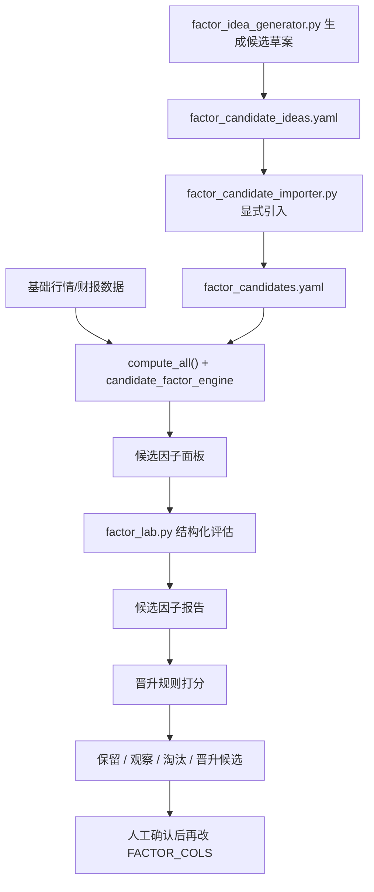

# 因子自动发现与验证机制设计

## 目标

给当前系统增加一条独立于线上主模型的研究流水线，用来：

1. 自动批量生成候选因子
2. 自动回测和评估候选因子
3. 自动生成保留/观察/淘汰建议
4. 只把通过门槛的因子放入“候选晋升队列”
5. 保持线上主模型稳定，不允许研究因子直接影响交易动作

这套机制的定位是：

- 自动研究
- 半自动筛选
- 人工晋升

不是：

- 自动把新因子直接上线
- 自动修改 `FACTOR_COLS / US_FACTOR_COLS`
- 自动改变策略页和交易触发


## 当前系统现状

当前仓库已经具备 4 个可复用基础件：

1. 因子计算层
   - `indicators.py`
   - `compute_all()`

2. 主模型评估层
   - `probability.py`
   - `probability_us.py`
   - 固定因子池内滚动 IC 自适应

3. 因子研究层
   - `factor_tear_sheet.py`
   - `factor_weighting.py`

4. 可靠度层
   - `reliability.py`
   - `build_reliability.py`

所以当前缺的不是“能不能评估因子”，而是：

- 没有候选因子注册表
- 没有批量候选生成器
- 没有统一研究结果库
- 没有晋升门槛和状态机
- 没有自动化研究工作流


## 总体架构

建议新增 7 个组件：

1. `factor_registry.py`
2. `candidate_factor_engine.py`
3. `factor_lab.py`
4. `factor_promotion.py`
5. `factor_lab_report.py`
6. `factor_idea_generator.py`
7. `factor_candidate_importer.py`

推荐输出 5 类数据文件：

1. `factor_candidates.yaml`
2. `factor_candidate_panel_{market}.csv`
3. `factor_candidate_report_{market}.csv`
4. `factor_promotion_queue.json`
5. `factor_candidate_ideas.yaml`

工作流如下：




## 组件设计

### 1. `factor_registry.py`

作用：

- 维护当前主模型因子清单
- 维护候选因子定义
- 维护因子元信息

每个因子应至少包含：

- `name`
- `market`
- `family`
- `source`
- `formula_type`
- `inputs`
- `status`
- `owner`
- `introduced_at`
- `notes`

状态建议分成：

- `active`
- `candidate`
- `trial`
- `watch`
- `rejected`
- `archived`

设计原则：

- `active` 因子来自当前 `FACTOR_COLS / US_FACTOR_COLS`
- 新因子先注册为 `candidate`
- 不允许未注册因子直接进入研究流水线


### 2. `candidate_factor_engine.py`

作用：

- 在现有 `compute_all()` 之后，批量构造候选因子
- 不污染主模型

候选因子来源建议分三层：

1. 手工定义的研究因子
   - 例如新看到的学术因子、宏观因子、行业因子

2. 自动变换因子
   - 平滑：rolling mean/std/zscore
   - 非线性：clip、rank、percentile
   - 交互：`factor_a * factor_b`
   - 条件：`factor_a * I(regime)`

3. 家族扩展因子
   - 对已有强因子做邻域变体
   - 例如：
     - `ROC20 -> ROC15 / ROC30`
     - `mfdfa_x_roc20 -> mfdfa_x_roc10 / 30`
     - `gap_ret_10d -> gap_ret_5d / 20d`

自动变换必须有限制，避免组合爆炸。

建议第一版只允许：

- 单因子窗口变体
- zscore 变体
- 两因子交互
- 条件 gating

不要第一版就做：

- 全组合搜索
- 大规模符号树搜索
- 遗传编程


### 2.1 `factor_idea_generator.py`

作用：

- 从 active 因子、当前候选池、宏观/行业主题和常见窗口变体中生成候选草案
- 输出 `factor_candidate_ideas.yaml`
- 不直接写入 `factor_candidates.yaml`

第一版候选来源：

- active 因子的窗口变体
  - `ROC20 -> roc15 / roc30 / roc60`
  - `gap_ret_10d -> gap_ret_3d / 5d / 20d / 30d`
  - `amihud_20d -> amihud_10d / 30d / 60d`
- rolling z-score 变体
  - `price_position_z20 / z60`
  - `atr_pct_z20 / z60`
  - `vol_surge_z20 / z60`
- 主题交互
  - AI/制造链：`ROC20 × vol_surge`, `high52w_pos × ROC20`
  - 宏观风险：`vix_z20 × atr_pct`, `vix_ma20_diff × ROC20`
  - A股政策/流动性代理：`price_position × vol_surge`, `gap_ret_10d × amihud_20d`

输出规则：

- 自动去掉 active 因子和已注册候选
- 默认状态为 `idea`
- 需要显式引入后才进入正式候选池


### 2.2 `factor_candidate_importer.py`

作用：

- 把 `factor_candidate_ideas.yaml` 中选定的草案引入 `factor_candidates.yaml`
- 支持按市场、按名称筛选
- 支持 `--dry-run`

示例：

```bash
python3 factor_idea_generator.py
python3 factor_candidate_importer.py --dry-run
python3 factor_candidate_importer.py --name roc60 --market us --status watch
```

设计原则：

- 草案生成可以自动执行
- 引入正式候选池需要显式命令
- 引入后仍只进入 `factor_lab` 研究层，不影响主模型


### 2.3 候选因子来源调研记录（2026-04-24）

候选因子池不应该只靠手工灵感扩展，需要形成稳定的外部来源漏斗。当前建议按以下优先级引入：

1. 公开论文和预印本
   - 主要渠道：arXiv、SSRN、NBER、期刊论文
   - 适合提取：可公式化的价格、成交量、波动率、行为金融、机器发现因子
   - 代表来源：WorldQuant 101 Formulaic Alphas、AutoAlpha、52-week high、MAX、overnight/intraday return、Amihud liquidity

2. 成熟因子库和策略数据库
   - 主要渠道：Quantpedia、BigQuant Alpha101 / AI Alphas、JoinQuant `jqfactor_analyzer`
   - 适合提取：已整理过的因子定义、A股可落地的字段组合、常见评估口径
   - 使用方式：只转译公式和研究假设，不直接采纳结论

3. 开源量化框架
   - 主要渠道：Microsoft Qlib、Alphalens、DolphinDB WorldQuant 101 Alphas
   - 适合提取：特征模板、评估指标、分组回测方式、去重和稳定性检查方法
   - 使用方式：对标当前 `factor_lab.py` 的评估口径，补齐缺失指标

4. 券商金融工程报告
   - 主要渠道：中信、广发、国信、华泰、海通等金工研报及其公开转载
   - 适合提取：A股微观结构、换手率、拥挤度、行业轮动、政策窗口代理
   - 使用方式：先落到 `factor_candidate_ideas.yaml`，小样本验证通过后再进入正式候选池

5. 宏观和行业数据源
   - 主要渠道：FRED、AKShare macro、Futu、yfinance、行业指数/ETF/供应链代理
   - 适合提取：美股利率/通胀/美元/VIX代理，A股政策窗口/流动性/行业热度代理
   - 使用方式：优先做 gating 或 interaction，不直接作为单一交易信号

推荐漏斗：

```text
论文 / 因子库 / 开源框架 / 金工研报 / 宏观行业数据
  -> factor_idea_generator.py
  -> factor_candidate_ideas.yaml
  -> factor_lab.py idea-only 同口径复测
  -> factor_candidate_importer.py 显式引入
  -> factor_candidates.yaml
  -> factor_promotion.py
  -> 人工确认后才进入 trial / active review
```

来源可信度建议：

- `source_score = 5`：有明确论文或成熟框架公式，且字段可复现
- `source_score = 4`：券商金工报告或大型平台因子库，逻辑清楚但需自行复刻
- `source_score = 3`：开源仓库或社区研究，有公式但缺少严谨样本说明
- `source_score = 2`：主题假设或行业代理，只有逻辑链，必须先做 shadow test
- `source_score = 1`：模型生成或弱证据想法，只能留在 `idea` 状态

后续应给候选因子补充元数据字段：

- `source_url`
- `evidence_type`
- `source_score`
- `source_notes`

这些字段只用于研究排序和审计留痕，不允许作为自动上线依据。


### 2.4 本地学习与测试指令

新增两条本地指令：

```bash
./scripts/factor_learn.sh
./scripts/factor_test.sh
```

`factor_learn.sh` 默认行为：

- 连续运行 60 分钟
- 生成 `factor_candidate_ideas.yaml`
- 用 `factor_lab.py` 对 `idea` 状态因子做轻量同口径预筛
- 输出 `factor_learning_queue.json`、`factor_learning_report.md`、`factor_learning_history.jsonl`
- 将通过预筛的草案写入 `factor_candidates.yaml`，状态为 `candidate` 或 `watch`
- 维护 `factor_learning_state.json`，记录已筛过的因子，避免重复选择同一候选
- 读取上一轮 `factor_promotion_queue.json`，按市场、因子家族、公式类型、证据类型调整下一轮学习排序
- 对测试队列做 fingerprint 去重，避免同一份测试结果被反复计入学习方向
- 围绕上一轮 `PROMOTE_TO_TRIAL / WATCH` 的因子自动生成邻近窗口变体，提高后续候选质量
- 不修改 `FACTOR_COLS / US_FACTOR_COLS`

常用参数：

```bash
./scripts/factor_learn.sh --duration-min 60
./scripts/factor_learn.sh --duration-min 15 --markets us
./scripts/factor_learn.sh --duration-min 60 --no-import
```

`factor_test.sh` 默认行为：

- 对 `factor_candidates.yaml` 里的 `candidate / watch / trial` 因子做全量复测
- 输出 `factor_candidate_{market}_report.csv`
- 输出 `factor_promotion_queue.json`
- 输出 `factor_test_decisions.md`
- 将 `PROMOTE_TO_TRIAL` 的因子标记为 `trial`
- 将 `WATCH` 的因子标记为 `watch`
- 生成 `factor_runtime_overlay.json`，记录当前被推送给决策层的 `trial` 因子
- 默认不把 `REJECT` 自动写成 `rejected`，除非显式加 `--apply-rejections`
- 不直接编辑 `FACTOR_COLS / US_FACTOR_COLS`，但 `probability.py / probability_us.py` 会在运行时自动加载 `trial` 因子并纳入 IC 加权评分

常用参数：

```bash
./scripts/factor_test.sh
./scripts/factor_test.sh --dry-run
./scripts/factor_test.sh --apply-rejections
```

生产接入边界：

- `candidate`：只进入测试池
- `watch`：继续观察，默认不影响生产评分
- `trial`：进入运行时决策 overlay，参与 `score_trend / score_trend_us` 的 IC 加权评分
- `active`：仍需人工确认后才写入 `FACTOR_COLS / US_FACTOR_COLS`
- `rejected`：不参与学习和测试，除非人工恢复

### 2.5 每日自动化

本地 `launchd` 已支持两个每日任务：

```bash
./install_launchd.sh install-factors
./install_launchd.sh uninstall-factors
./install_launchd.sh status
```

任务安排：

- `com.maxwu.factor-learning`
  - 每天 12:10 本机时间运行
  - 调用 `run_factor_learning_daily.sh`
  - 默认运行 60 分钟
  - 日志：`factor_learning_daily.log`

- `com.maxwu.factor-testing`
  - 每天 13:25 本机时间运行
  - 调用 `run_factor_testing_daily.sh`
  - 复测候选池并推送达标因子到 `trial`
  - 日志：`factor_testing_daily.log`

两个 wrapper 都有锁：

- `.factor_learning.lock`
- `.factor_testing.lock`

如果上一轮未结束，下一轮会跳过，避免重复占用数据源或同时写候选池。

自动化运行约束：

- 不需要人工确认或批准
- 不调用交易解锁、下单或实盘交易接口
- `NONINTERACTIVE=1`
- `GIT_TERMINAL_PROMPT=0`
- `PIP_NO_INPUT=1`
- `MPLBACKEND=Agg`

如果底层网络、行情源或 Python 依赖失败，任务会写日志并退出，不会等待人工输入。


### 3. `factor_lab.py`

作用：

- 批量评估候选因子
- 输出和当前 tear sheet 一致风格的结构化结果

应支持：

- `--market a/us`
- `--status candidate/watch`
- `--symbols subset`
- `--max-candidates N`
- `--with-active-baseline`

评估指标建议至少包含：

- `coverage`
- `IC`
- `RankIC`
- `Q5-Q1 收益差`
- `Q5-Q1 涨率差`
- `first_half / second_half stability`
- `cross-symbol consistency`
- `corr_with_active_best`
- `incremental_score`

这里最关键的是加入两个新指标：

1. `orthogonality_score`
   - 与当前 active 因子中最相关者的绝对相关度
   - 太高说明是重复噪声

2. `incremental_value`
   - 单独有效还不够
   - 需要判断加入现有因子池后是否带来增量

建议定义为：

- 单因子好看，但与 active 高相关：降级到 `watch`
- 单因子一般，但加到小模型里能改善 `RankIC / 盈亏比 / 可靠度`：可晋升


### 4. `factor_promotion.py`

作用：

- 把研究结果转成“可执行的晋升建议”

建议输出 4 类结论：

- `REJECT`
- `WATCH`
- `PROMOTE_TO_TRIAL`
- `PROMOTE_TO_ACTIVE_REVIEW`

推荐门槛：

#### 直接拒绝

满足任一：

- `coverage < 50%`
- `|rankic| < 0.01`
- `stable_halves = false`
- 与某个 active 因子相关度 `> 0.85` 且没有增量

#### 观察

满足：

- 指标局部有效
- 但样本少，或只在个别标的有效

#### 晋升到试验池

满足：

- `mean_abs_rankic` 超过当前家族中位数
- `stable_halves = true`
- `cross-symbol consistency` 过线
- 小规模组合回测有增量

#### 晋升到正式评审

满足：

- A 股或美股样本均有增量
- 不恶化现有策略页 precision
- 不显著增加因子冗余

注意：

- `PROMOTE_TO_ACTIVE_REVIEW` 也不等于自动上线
- 只进入人工确认队列


### 5. `factor_lab_report.py`

作用：

- 生成研究摘要
- 给你看“最近哪些因子值得继续”

建议输出：

- `Top New Factors`
- `Rejected This Round`
- `High Correlation Duplicates`
- `Potential Family Winners`
- `Promotion Queue`

这份报告可以后续接到页面的研究区，但默认不进生产页面。


## 数据文件设计

### `factor_candidates.yaml`

记录候选因子定义。

建议结构：

```yaml
- name: gap_ret_5d
  market: a
  family: behavior
  status: candidate
  source: manual
  formula_type: rolling_mean
  inputs: [gap_ret_1d]
  params:
    window: 5
  notes: overnight short-term variant
```


### `factor_candidate_report_{market}.csv`

建议列：

- `factor`
- `family`
- `status`
- `coverage`
- `ic_5`
- `rankic_5`
- `ic_10`
- `rankic_10`
- `ic_30`
- `rankic_30`
- `stable_halves`
- `cross_symbol_consistency`
- `max_corr_active`
- `incremental_rankic_lift`
- `incremental_pnl_lift`
- `decision`
- `reason`


### `factor_promotion_queue.json`

只存可以进入人工评审的候选：

- 因子名
- 市场
- 决策
- 证据摘要
- 推荐加入位置
- 推荐替换对象


## 自动化流程

建议拆成 3 个自动任务。

### 任务 A：每日轻量更新

频率：

- 每个交易日收盘后

动作：

- 只更新候选面板
- 不跑完整研究

目的：

- 给研究层缓存最新数据


### 任务 B：每周研究任务

频率：

- 每周一次

动作：

- 跑 `factor_lab.py`
- 更新 `factor_candidate_report`
- 更新 `factor_promotion_queue`

目的：

- 持续评估新因子


### 任务 C：人工审核后晋升

触发：

- 手动

动作：

- 从 `promotion_queue` 中挑选因子
- 更新 `FACTOR_COLS / US_FACTOR_COLS`
- 重跑：
  - `factor_tear_sheet.py`
  - `build_reliability.py`
  - `generate_page.py`

目的：

- 保证生产模型稳定


## 防过拟合与风控

这套机制最容易出问题的地方，不是“找不到新因子”，而是“找到一堆伪因子”。

必须加 6 条硬约束：

1. 候选因子不能直接自动进主模型
2. 单市场单标的有效，不算通过
3. 不能只看 `RankIC`，必须看稳定性
4. 必须做 active 因子相关性去重
5. 必须做小组合增量测试
6. 必须保留 reject 原因，避免重复试错

建议额外加两条：

- 同一因子若连续 3 轮 `REJECT`，自动归档
- 同族候选每轮最多晋升 1 个，防止家族堆积


## 与现有系统的接线位置

### 直接复用

- `indicators.py`
- `compute_all()`
- `factor_tear_sheet.py`
- `factor_weighting.py`
- `reliability.py`
- `build_reliability.py`

### 新增但不改线上逻辑

- `factor_registry.py`
- `candidate_factor_engine.py`
- `factor_lab.py`
- `factor_promotion.py`
- `factor_lab_report.py`

### 只有人工确认后才改

- `probability.py`
- `probability_us.py`


## 推荐开发顺序

### Phase 1：研究框架成型

交付：

- `factor_registry.py`
- `factor_candidates.yaml`
- `candidate_factor_engine.py`
- `factor_lab.py`

目标：

- 先把候选因子批量评估跑起来


### Phase 2：晋升规则成型

交付：

- `factor_promotion.py`
- `factor_promotion_queue.json`

目标：

- 自动给出保留/淘汰建议


### Phase 3：自动化任务

交付：

- `.github/workflows/factor-lab.yml`

目标：

- 每周自动更新研究结果


### Phase 4：研究摘要展示

交付：

- `factor_lab_report.py`
- 可选接到 `review.html` 或单独 `research.html`

目标：

- 让研究层可读


## 验收标准

满足以下条件，才算这套机制可用：

1. 能批量评估至少 20 个候选因子
2. 能自动输出 `REJECT / WATCH / PROMOTE` 决策
3. 能识别与 active 因子的高相关重复项
4. 能生成晋升候选队列
5. 不会自动改动线上策略页和交易动作


## 建议的第一批候选因子来源

基于当前系统，第一批最值得接入自动实验的不是完全陌生的学术因子，而是：

1. 现有强因子的窗口变体
   - `ROC15 / ROC30`
   - `gap_ret_5d / 20d`
   - `amihud_10d / 30d`

2. 已验证家族的交互变体
   - `mfdfa_width_120d * ROC10`
   - `hq2_120d * amihud_20d`
   - `high52w_pos * vol_surge`

3. 宏观层轻量候选
   - `vix_term_delta`
   - `event_proximity_score`
   - `northbound_flow_proxy`

4. 行业内条件因子
   - 半导体专属
   - AI 制造链专属
   - 白酒/地产专属

这样更容易找到真正有增量的因子，而不是盲目暴力搜索。


## 最后结论

当前系统最适合的不是“完全自动因子发现”，而是：

`自动候选生成 + 自动评估 + 自动晋升建议 + 人工确认上线`

这是对你现在这套：

- 固定主模型
- 交易动作层
- 页面发布链

最稳妥的扩展方式。
